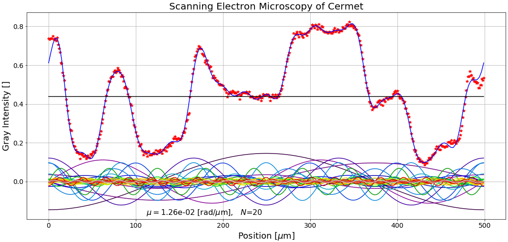

# ChEn-3170 Computational Methods in Chemical Engineering 

   + [University of Massachusetts Lowell](https://www.uml.edu/), Fall 2020
   + [Dept. of Chemical Engineering](https://www.uml.edu/Engineering/Chemical/) (Nuclear Program)
   + [Prof. Valmor F. de Almeida](https://www.uml.edu/Engineering/Chemical/faculty/de-Almeida-Valmor.aspx) (valmor_dealmeida@uml.edu)

The goal of this course is to present to students of (nuclear) chemical engineering an interconnected set of computational methods needed in the core undergraduate chemical engineering curriculum. In particular, methods that assist the students in solving problems in the core areas of chemical reaction equilibria, separations, unit operations, and chemical reactor engineering with applications in nuclear and biochemical engineering.

This three-credit lecture course (and one additional contact hour) over fifteen weeks, consists of Jupyter notebooks used for lectures (numbered 01 to 21) and laboratory work (labwork-01 to 14) for students to practice their skills in computer-aided problem solving (see `notebooks/`). The assumption is that students have little computer pragramming experience and are currently taking the core courses in chemical engineering up in the second semester of the junior year. Therefore this course is a mix of computational methods and computer programming (in python language) aimed at helping students in the remaining portion of their curriculum course work. 

*Past versions of this course are available in this repository as [releases](https://github.com/dpploy/chen-3170/releases) including labwork and exams.*

Feedback and collaboration to improve this course are welcome through GitHub `pull requests` and `issues` or direct email. 

This course uses Jupyter Notebooks in Python programming language. The content can be accessed in
the following ways:
+ Static HTML version of the notebooks will be displayed on the current browser if a 
notebook file listed in the code repository, `notebook/` is clicked on. This will not allow for rendering mathematical formulae. Alternatively you can render the notebooks on [NBViewer](http://nbviewer.jupyter.org/) by **clicking on the  badge above**.
+ Click on the `Azure Notebooks|launch` above to use the Azure Notebook service; this is practical since you can use your UMass Lowell credentials to login into the site and use the GitHub upload option to clone the repository in your account.
+ Click on the `launch/binder` badge above to launch a Jupyter Notebook server for the
course notebooks. There will be a delay for the Binder cloud server to build a 
Python (Anaconda) programming environment for you. However once it is done, it will 
start a Jupyter Notebook server on your web browser with all notebooks listed. Upon 
clicking on individual notebook files, you will access the live course notebooks.
+ Use the green `download` button above on the right upper side of the page and download a ZIP archive to your local machine. Unzip the archive. Then use your own Jupyter Notebook server to navigate to the directory created by the unzip operation and upload the notebook files. In this case the files will not be updated and you will need to return to the repository for getting new files or updated versions of previously downloaded files.

Thanks in advance for inputs to improve this course.\
Regards,\
Prof. Valmor F. de Almeida
